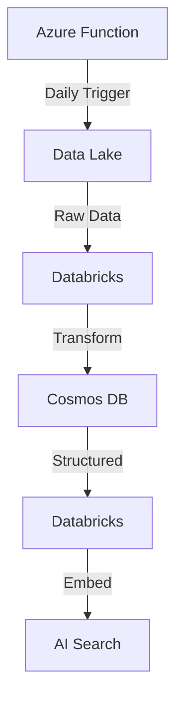

# 🤖 AI Trends ChatBot

> 🌟 A modern AI-powered chat application for exploring and discussing AI trends with real-time insights and analytics.

[](https://nextjs.org/)
[](https://www.typescriptlang.org/)
[](https://tailwindcss.com/)
[](https://supabase.com/)
[](https://daisyui.com/)

## 📚 Table of Contents

- [Overview](#-overview)
- [Features](#-features)
- [Frontend Architecture](#-frontend-architecture)
- [Data Pipeline](#-data-pipeline)
- [Backend Services](#-backend-services)
- [Getting Started](#-getting-started)
- [Environment Setup](#-environment-setup)
- [Contributing](#-contributing)
- [RSS Feed Sources](#-rss-feed-sources)
- [Virtual Environment Setup](#-virtual-environment-setup)

## 🎯 Overview

AI Trends ChatBot is a sophisticated web application that combines modern authentication, real-time chat capabilities, and AI-powered insights to provide users with an interactive platform for exploring artificial intelligence trends and developments.

## ✨ Features

### 🔐 Authentication & User Management

- Secure email-based authentication
- User profile customization
- Protected routes and middleware
- Email verification flow
- Session management

### 💬 Chat Interface

- Real-time messaging
- Modern, responsive design
- Mobile-friendly interface
- Dark/Light theme support
- Message history persistence

### 📊 Insights Dashboard

- AI trends visualization
- Real-time analytics
- Interactive data exploration
- Customizable views

## 🏗 Frontend Architecture

### 🛠 Tech Stack

- **Framework**: Next.js 13 (App Router)
- **Language**: TypeScript
- **Styling**: Tailwind CSS + DaisyUI
- **Authentication**: Supabase Auth
- **State Management**: React Hooks
- **Components**: Server & Client Components

### 📁 Project Structure

```
frontend/
├── src/
│   ├── app/
│   │   ├── auth/
│   │   │   ├── login/
│   │   │   ├── register/
│   │   │   └── confirm-email/
│   │   ├── dashboard/
│   │   │   ├── chat/
│   │   │   └── insights/
│   │   └── layout.tsx
│   ├── components/
│   │   ├── UserNav.tsx
│   │   └── ChatInterface.tsx
│   ├── lib/
│   │   └── supabase/
│   └── styles/
└── public/
```

### 🎨 Key Components

- **UserNav**: User profile and navigation
- **ChatInterface**: Real-time chat functionality
- **DashboardLayout**: Protected layout with navigation
- **AuthForms**: Login and registration forms

## 🔄 Data Pipeline

Our data pipeline leverages Azure services to collect, process, and serve AI news and trends efficiently.

### 🏗 Architecture Overview



### 🔧 Components

1. **Azure Function**

   - Timer-triggered RSS feed scraper
   - Collects data from various AI news sources
   - Outputs raw JSON to Data Lake
2. **Databricks Processing**

   - Bronze to Silver: Data Lake → Cosmos DB transformation
   - Silver to Gold: Cosmos DB → AI Search with embeddings
   - Automated scheduling and monitoring
3. **Storage Layers**

   - Bronze: Data Lake (raw RSS feed data)
   - Silver: Cosmos DB (structured articles)
   - Gold: AI Search (searchable embeddings)

### 🛠 Infrastructure

- **Infrastructure as Code**: Managed via Terraform
- **Security**:
  - Managed Identities for service authentication
  - Key Vault for secret management
  - Event Grid for secure triggers

### 📁 Pipeline Structure

```
azure-pipeline/
├── azure-function/     # RSS feed collection
├── databricks/        # Data transformation
└── terraform/         # Infrastructure as Code
```

## 🔧 Backend Services

> 🚧 **Coming Soon**: Backend Implementation

### Planned Features

- API endpoints
- Data persistence
- Business logic
- Integration services

## 🚀 Getting Started

### Frontend Setup

1. **Clone the repository**

   ```bash
   git clone https://github.com/yourusername/AI-Trends-ChatBot.git
   cd AI-Trends-ChatBot
   ```
2. **Install dependencies**

   ```bash
   npm install
   ```
3. **Set up environment variables**

   - Copy the `.env.example` file to `.env.local`

   ```bash
   cp .env.example .env.local
   ```

   - Fill in your environment variables in `.env.local`:
     ```env
     NEXT_PUBLIC_SUPABASE_URL=your_supabase_url
     NEXT_PUBLIC_SUPABASE_ANON_KEY=your_supabase_anon_key
     ```
4. **Run the development server**

   ```bash
   npm run dev
   ```
5. **Open your browser**
   Navigate to [http://localhost:3000](http://localhost:3000) to see the application running.

### Build for Production

To create a production build:

```bash
npm run build
# or
yarn build
# or
pnpm build
```

Then start the production server:

```bash
npm start
# or
yarn start
# or
pnpm start
```

## ⚙️ Environment Setup

Required environment variables:

```env
NEXT_PUBLIC_SUPABASE_URL=your_supabase_url
NEXT_PUBLIC_SUPABASE_ANON_KEY=your_supabase_anon_key
NEXT_PUBLIC_SITE_URL=your_site_url
```

## 🤝 Contributing

We welcome contributions! Please see our [Contributing Guide](CONTRIBUTING.md) for details.

## 📰 RSS Feed Sources

> Comprehensive list of AI news and research sources for data collection

### 🎯 Major Tech Companies

- **[Google DeepMind](https://deepmind.google/discover/blog/)**
  - RSS: [`deepmind.google/blog/rss.xml`](https://deepmind.google/blog/rss.xml)
- **[Microsoft Research](https://www.microsoft.com/en-us/research/)**
  - RSS: [`microsoft.com/en-us/research/feed`](https://www.microsoft.com/en-us/research/feed/)
- **[Amazon Science](https://www.amazon.science/)**
  - RSS: [`amazon.science/index.rss`](https://www.amazon.science/index.rss)
- **[Google Research](https://research.google/blog/)**
  - Blog URL: [`research.google/blog`](https://research.google/blog/)

### 🎓 Academic & Research

- **[MIT News - Artificial Intelligence](https://news.mit.edu/topic/artificial-intelligence2)**
  - RSS: [`news.mit.edu/topic/mitartificial-intelligence2-rss.xml`](https://news.mit.edu/topic/mitartificial-intelligence2-rss.xml)
- **[IEEE Spectrum - AI](https://spectrum.ieee.org/)**
  - RSS: [`spectrum.ieee.org/feeds/topic/artificial-intelligence.rss`](https://spectrum.ieee.org/feeds/topic/artificial-intelligence.rss)

### 📱 Tech News & Media

- **[TechCrunch - AI](https://techcrunch.com/category/artificial-intelligence/)**
  - RSS: [`techcrunch.com/category/artificial-intelligence/feed`](https://techcrunch.com/category/artificial-intelligence/feed/)
- **[The Guardian - AI](https://www.theguardian.com/technology/artificialintelligenceai)**
  - RSS: [`theguardian.com/technology/artificialintelligenceai/rss`](https://www.theguardian.com/technology/artificialintelligenceai/rss)
- **[The Verge - AI](https://www.theverge.com/ai-artificial-intelligence)**
  - RSS: [`theverge.com/ai-artificial-intelligence/rss/index.xml`](https://www.theverge.com/ai-artificial-intelligence/rss/index.xml)
- **[VentureBeat - AI](https://venturebeat.com/category/ai/)**
  - RSS: [`venturebeat.com/category/ai/feed`](https://venturebeat.com/category/ai/feed/)
- **[Ars Technica - AI](https://arstechnica.com/ai/)**
  - Tech RSS: [`feeds.arstechnica.com/arstechnica/technology-lab`](https://feeds.arstechnica.com/arstechnica/technology-lab)
- **[SiliconANGLE - AI](https://siliconangle.com/category/ai/)**
  - RSS: [`siliconangle.com/category/ai/feed`](https://siliconangle.com/category/ai/feed/)

### 💡 AI Specialized

- **[AI Business](https://aibusiness.com/)**
  - RSS: [`aibusiness.com/rss.xml`](https://aibusiness.com/rss.xml)
- **[Last Week in AI](https://lastweekin.ai/)**
  - RSS: [`lastweekin.ai/feed`](https://lastweekin.ai/feed)
- **[Analytics India Magazine](https://analyticsindiamag.com/)**
  - RSS: [`analyticsindiamag.com/feed`](https://analyticsindiamag.com/feed/)
- **[AI News](https://www.artificialintelligence-news.com/)**
  - RSS: [`artificialintelligence-news.com/feed`](https://www.artificialintelligence-news.com/feed/)
- **[Unite.AI](https://www.unite.ai/)**
  - RSS: [`unite.ai/feed`](https://www.unite.ai/feed/)
- **[Import AI](https://jack-clark.net/)**
  - RSS: [`jack-clark.net/feed`](https://jack-clark.net/feed/)
- **[MarkTechPost](https://www.marktechpost.com/)**
  - RSS: [`marktechpost.com/feed`](https://www.marktechpost.com/feed/)
- **[Synced](https://syncedreview.com/)**
  - RSS: [`syncedreview.com/feed`](https://syncedreview.com/feed/)

### 🔬 Technical & Developer

- **[InfoQ - AI/ML](https://www.infoq.com/ai-ml-data-eng/)**
  - RSS: [`feed.infoq.com/ai-ml-data-eng`](https://feed.infoq.com/ai-ml-data-eng/)
- **[HackerNoon - AI](https://hackernoon.com/tagged/ai)**
  - RSS: [`hackernoon.com/tagged/ai/feed`](https://hackernoon.com/tagged/ai/feed)
- **[TechXplore - AI/ML](https://techxplore.com/machine-learning-ai-news/)**
  - RSS: [`techxplore.com/rss-feed/machine-learning-ai-news`](https://techxplore.com/rss-feed/machine-learning-ai-news/)
- **[The Register - AI/ML](https://www.theregister.com/software/ai_ml/)**
  - RSS: [`theregister.com/software/ai_ml/headlines.atom`](https://www.theregister.com/software/ai_ml/headlines.atom)

### 📊 Data Science & Industry

- **[Dataconomy - AI](https://dataconomy.com/category/topics/data-science/artificial-intelligence/)**
  - RSS: [`dataconomy.com/category/topics/data-science/artificial-intelligence/feed`](https://dataconomy.com/category/topics/data-science/artificial-intelligence/feed/)
- **[AI Accelerator Institute](https://www.aiacceleratorinstitute.com/)**
  - RSS: [`aiacceleratorinstitute.com/rss`](https://www.aiacceleratorinstitute.com/rss/)
- **[AI Hub News](https://aihub.org/category/news/)**
  - RSS: [`aihub.org/category/news/feed`](https://aihub.org/category/news/feed/)
- **[AI Tech Park](https://ai-techpark.com/ai/)**
  - RSS: [`ai-techpark.com/feed`](https://ai-techpark.com/feed/)

### 🤖 Community & Forums

- **[Reddit - Machine Learning News](https://www.reddit.com/r/machinelearningnews/)**
  - API: [`reddit.com/r/machinelearningnews.json?limit=50`](https://www.reddit.com/r/machinelearningnews.json?limit=50)

## 📚 Virtual Environment Setup

### Prerequisites

- Python 3.9+
- pip
- virtualenv (optional but recommended)

### Setup for Each Component

#### RSS Scrapers

```bash
cd rss-scrapers
python -m venv venv
source venv/bin/activate  # On Windows: venv\Scripts\activate
pip install -r requirements.txt
```

#### Data Pipeline

```bash
cd azure-data-pipeline
python -m venv venv
source venv/bin/activate  # On Windows: venv\Scripts\activate
pip install -r requirements.txt
```

#### Chatbot

```bash
cd chatbot
python -m venv venv
source venv/bin/activate  # On Windows: venv\Scripts\activate
pip install -r requirements.txt
```

### Deactivating Virtual Environments

```bash
deactivate
```

## Development Workflow

1. Create virtual environment
2. Activate environment
3. Install dependencies
4. Work on your component
5. Deactivate when done

## Notes

- Each component has its own isolated environment
- Specific package versions ensure consistency
- Easy to manage dependencies per module

---

<div align="center">

| 📝**License** |         MIT         |
| :-----------------: | :-----------------: |
| 🔨**Status** |   In Development   |
| 🌐**Website** | [AI Trends ChatBot](#) |
| 📧**Contact** |    [Your Email](#)    |

</div>
