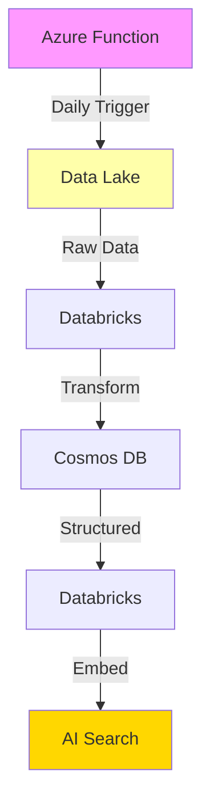

# AI Trends Pipeline

A complete data pipeline for collecting, processing, and serving AI news and trends using Azure services.

## Project Structure

```
azure-pipeline/
├── azure-function/              # RSS feed collection
├── databricks/                  # Data transformation
└── terraform/                   # Infrastructure as Code
```

## Data Architecture

### Pipeline Overview



### Components

1. **Azure Function**
   - Timer-triggered RSS feed scraper
   - Outputs: Raw JSON to Data Lake

2. **Databricks Notebooks**
   - `bronze_to_silver.py`: Data Lake → Cosmos DB
   - `silver_to_gold.py`: Cosmos DB → AI Search with embeddings

3. **Storage Services**
   - Data Lake: Bronze layer (raw data)
   - Cosmos DB: Silver layer (structured data)
   - AI Search: Gold layer (searchable embeddings)

## Setup

1. Deploy infrastructure:
   ```powershell
   cd terraform
   ./deploy.ps1
   ```

2. Configure secrets in Azure Key Vault:
   - OpenAI API credentials
   - RSS feed URLs
   - Database connections

3. Upload Databricks notebooks and set up job schedule

## Security

- Managed Identities for service authentication
- Key Vault for secret management
- Event Grid for secure pipeline triggers
