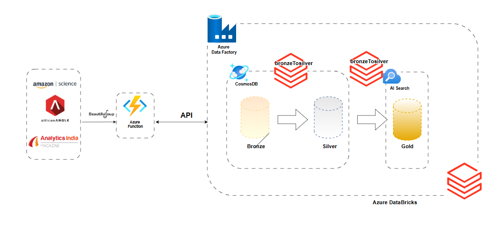

# 🌟<font color="blue"> End To End Azure Data Pipeline (Applied Approach)</font>

## <font color="green"> Data Architecture</font>  


## <font color="purple"> Data Schemas</font>
### Bronze Layer (Raw Data Schema)
```json
{
    "guid": "string", 
    "title": "string", 
    "link": "string", 
    "pub_date": "string (e.g., Thu, 21 Nov 2024 20:40:55 GMT)", 
    "description": "string", 
    "content": "string", 
    "id": "string (UUID)", 
    "processed": "boolean"
}
```

### Silver Layer
```json
{
    "id": "string (UUID)",
    "news_id": "string (UUID)",
    "guid": "string",
    "pub_date": "string (ISO 8601 format, e.g., 2024-11-21T20:40:55)", 
    "chunk_text": "string",
    "start_index": "integer",
    "end_index": "integer",
    "processed": "boolean",
    "_rid": "string",
    "_self": "string",
    "_etag": "string",
    "_attachments": "string",
    "_ts": "integer (timestamp)"
}
```

### Gold Layer (Raw Data)
```json
{
    "id": "string (UUID)",
    "embedding_vec": "array of floats",
    "pub_date": "string (ISO 8601 format, e.g., 2024-11-11T15:14:48Z)"
}
```

## <font color="orange"> Transformation Process</font>

### Bronze to Silver Transformation
The application starts by extracting the data that is not processed yet using SQL API queries. This means the news text is not split initially, and the `processed` attribute is used to verify unprocessed data. In this step:
- The application extracts new data from the Bronze layer.
- The news text is split into chunks.
- The chunks are stored in the Silver layer.

### Silver to Gold Transformation
After storing the chunks in the Silver layer:
- The application extracts chunks that are not embedded yet, verifying them using the `processed` attribute.
- The chunks are then embedded using a suitable model (e.g., SentenceTransformer).
- Finally, the embedded chunks are stored in the Gold layer.
