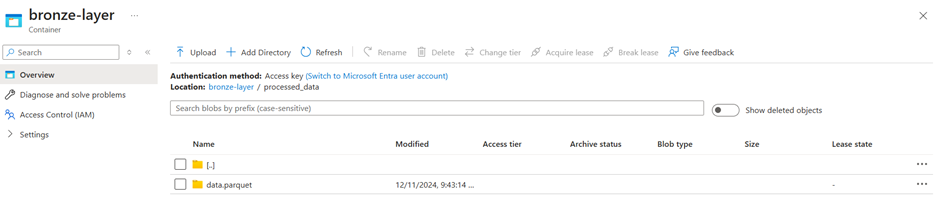

# 🌟 End To End Azure Data Pipeline

##  Overview
This approach involves extracting raw data from a data lake and transforming it into a format suitable for AI Search. The bronze and silver layers exist in Azure Data Lake, providing structured storage for the extracted data.

##  Key Components
1. **bronze2silver.ipynb**: This notebook extracts data from the data lake and transforms it into the silver layer.
2. **silver2gold.ipynb**: This notebook converts the silver layer data into the gold layer, preparing it for AI Search.

##  Data Transformation
### 🔄 Transformation Process
- Transformation is conducted using **Azure Databricks** and **Azure Data Factory**.

### 📓 Notebook - bronze2silver
- **Process**:
  - Checks for the existence of new data in the bronze-layer container. If new data exists, it is:
    - 📖 Read with **PySpark**.
    - 🔄 Transformed and processed.
    - ✂️ Content is split into chunks using `RecursiveTextSplitterCharacter` from **LangChain**.
    - 💾 Reconstructed and stored in the silver-container.
- **Resulted Schema**:
  - `chunk_id`: UUID
  - `guid`: String
  - `pub_date`: DateTime
  - `chunk_text`: String
  - `start_index`: Int
  - `end_index`: Int

### 📓 Notebook - silver2gold
- **Process**:
  1. Extracts data from silver-layer container (new_chunks.parquet).
  2. Embeds text chunks using the **SentenceTransformer** model (all-MiniLM-L6-v2).
  3. Constructs the schema:
     - `embedd_vec_id`: Identifier for the embedding vector (same as `chunk_id`).
     - `pub_date`: Publication date of the original article.
     - `chunk_text`: Text chunk.
     - `start_index`: Start index of the chunk.
     - `end_index`: End index of the chunk.
     - `embedding`: List of floats representing the embedding vector.
  4. Stores the data in an Azure vector database (Cognitive Search).
  5. Appends new_chunks.parquet to chunks.parquet in silver-layer/processed_data.

### ➡️ Approach:
- The processed_data folder in each container is used to handle and track only the newly extracted data.

## Incremental Loading Process ⏳
In this case, we handle the incremental loading of new data from the Bronze to Silver layer by processing only new data and also loading new data from the Silver to Gold layer. We adopted a different approach by creating a `processed_data` folder in the Bronze layer. This folder is used to manage new details coming into the Bronze layer. 🗂️ 

For example, in the Bronze layer, we create a `processed_data` folder.

 When new data arrives, it is extracted from the Bronze layer and processed before being added to this folder
 
 

 . 🔄 The same process occurs in the Silver layer, allowing us to effectively manage incremental loading.
