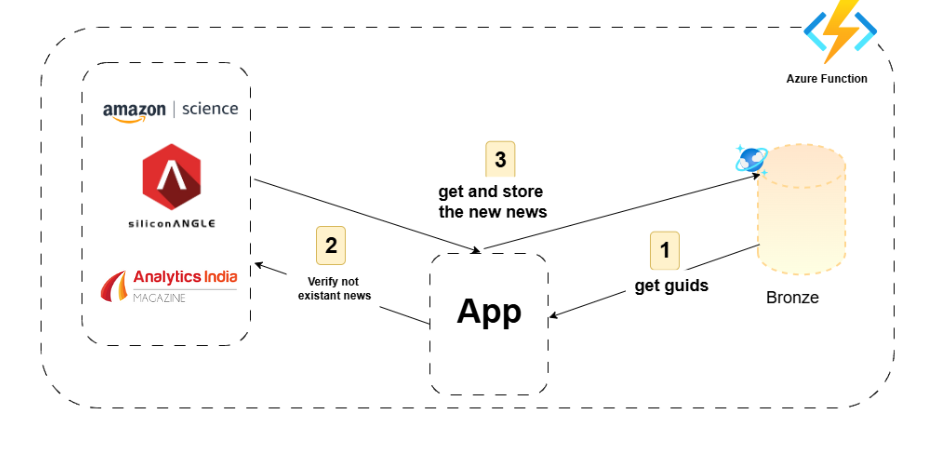

# 🌟 Scraper Function

## Extraction Process Using Azure Functions

The extraction process leverages Azure Functions to incrementally extract data from multiple sources based on unique **guid** values. Here’s how the process works:

1. **🔍 Purpose of Azure Function**:  
   The Azure Function is designed to extract data every time new information is available. It ensures that only new data is fetched by utilizing unique **guid** attributes.

2. **📊 Extraction Process**:  
   - The Azure Function is triggered twice a day to start the extraction process.  
   - It uses the **"guid"** attribute to filter and extract only the new data from the websites.  
   - Each news item has a unique value in the attribute **"guid"**, which serves as a unique identifier for the news item. The **"guid"** attribute plays a crucial role in the extraction process as it allows us to keep track of the news items that have already been extracted, thereby preventing duplication. We rely on this attribute to extract only new news that has not been previously extracted. This ensures that our data extraction process is efficient and avoids duplication.
   -   

3. **🔗 Single Function Usage**:  
   - Despite having multiple source websites, we utilize just one Azure Function to handle the extraction process for all sources.  
   - This approach simplifies the architecture and reduces overhead by managing multiple sources through a single function, which is efficient and easier to maintain.

### 💰 Total Cost

The **Total Cost** can be calculated using the formula:

**Total Cost** =  
> **💻 Execution Cost + 💾 Storage Cost + 🌐 Outbound Data Transfer Cost**

### 💻 Execution Cost

The **Execution Cost** can be calculated using the formula:

**Execution Cost** =  
> **(🔢 Number of Executions) × (⏱️ Execution Time (in seconds)) × (💾 Memory Size (in GB)) × (💲 Price per GB-second)**

This equation helps in understanding the cost implications of running Azure Functions based on their usage.